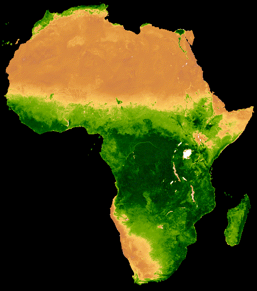

# **ProtocolGEE_Readme**

Hello, as ProtocolGEE pulls from Google Earth Engine to my local repository and to Github, I can't edit the readme there without causing an error. This repository is just for writing a readme. The code can be accessed at https://github.com/jamestansongen/ProtocolGEE or the relevant tutorials. The CASA0023 entries are not covered here as they can be read in the learning diary: https://jamestansongen.github.io/CASA0023_Learning-Diary/

## **Entry 3: War at Night**

Tutorial Source: [War at Night](https://github.com/gena/earthengine-api](https://bellingcat.github.io/RS4OSINT/C1_Lights.html)

## **Entry 2: Night Time Lights**

Tutorial Source: [earthengine-api](https://github.com/gena/earthengine-api)

## **Entry 1: NDVI Timelapse**

Tutorial Source: [MODIS NDVI Times Series Animation](https://developers.google.com/earth-engine/tutorials/community/modis-ndvi-time-series-animation)
